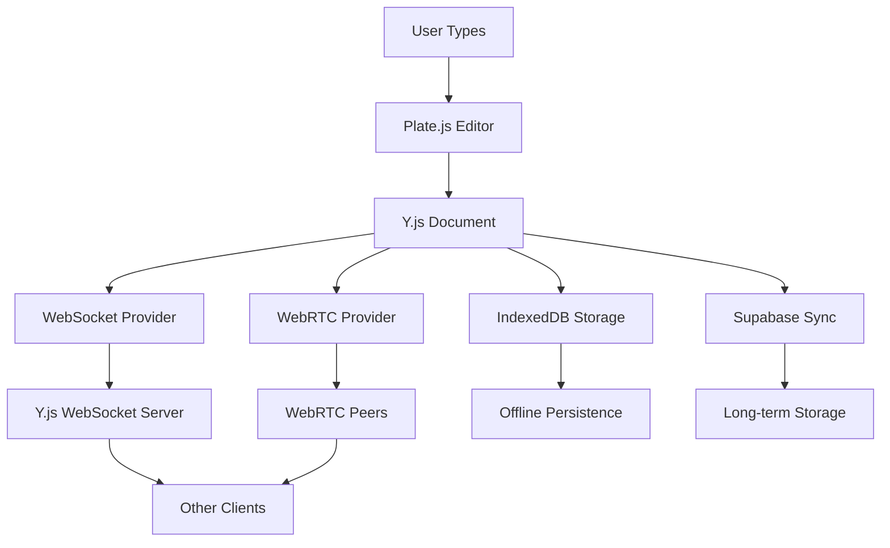

# Collaborative Editing with Y.js CRDT

## Overview

Notable implements real-time collaborative editing using **Y.js (Yjs) CRDT** (Conflict-free Replicated Data Types) integrated with **Plate.js** rich text editor. This provides seamless multi-device synchronization with automatic conflict resolution, even during simultaneous edits.

## Architecture

### Components

1. **Y.js CRDT Document** - Shared data structure for collaborative editing
2. **Plate.js Editor** - Rich text editor with Y.js integration via `@platejs/yjs`
3. **WebSocket Provider** - Server-based real-time synchronization
4. **WebRTC Provider** - Peer-to-peer synchronization (fallback)
5. **IndexedDB Persistence** - Offline storage and persistence
6. **Supabase Integration** - Long-term storage and cross-session sync

### Data Flow



## Features

### Real-time Collaboration
- **Sub-second latency** for live collaborative editing
- **Presence awareness** showing active collaborators
- **Cursor tracking** (future enhancement)
- **User identification** with names and colors

### Conflict Resolution
- **Automatic CRDT merging** without manual intervention
- **Operational transformation** for text editing operations
- **Intent preservation** during concurrent edits
- **No data loss** during conflicts

### Offline Support
- **IndexedDB persistence** for offline editing
- **Automatic sync** when connection is restored  
- **Local-first architecture** with server sync
- **Conflict resolution** for offline changes

### Cross-Device Sync
- **WebSocket real-time sync** for active sessions
- **WebRTC P2P sync** for direct device communication
- **Supabase persistence** for cross-session data
- **Progressive enhancement** with multiple transport layers

## Implementation

### 1. Rich Text Editor Component

The `RichTextEditor` component replaces the simple textarea with a Y.js-enabled Plate.js editor:

```typescript
import { RichTextEditor } from './components/rich-text-editor'

<RichTextEditor
  noteId={note.id}
  userId={currentUser.id}
  username={currentUser.name}
  isEditing={true}
  autoSave={true}
  onSave={handleSave}
/>
```

**Key Features:**
- Rich text formatting (bold, italic, underline, etc.)
- Real-time collaborative editing
- Connection status indicator
- Active collaborator display
- Auto-save functionality

### 2. Y.js Document Structure

Each note creates a Y.js document with the following structure:

```javascript
const ydoc = new Y.Doc()
const ytext = ydoc.get('content', Y.XmlFragment) // Rich text content
const ymeta = ydoc.get('metadata', Y.Map)        // Note metadata
```

### 3. WebSocket Server

Standalone Y.js WebSocket server handles real-time synchronization:

```bash
# Start Y.js server (runs on port 1234 by default)
pnpm yjs:server

# Start both Next.js and Y.js server
pnpm dev:with-yjs
```

**Server Features:**
- Room-based document isolation
- User authentication integration
- Connection management
- Graceful shutdown handling

### 4. Collaborative Sync Hook

The `useCollaborativeSync` hook bridges Y.js with the existing Supabase sync infrastructure:

```typescript
import { useCollaborativeSync } from '../hooks/use-collaborative-sync'

const {
  ydoc,
  isConnected,
  collaborators,
  syncToSupabase,
  loadFromSupabase
} = useCollaborativeSync({
  noteId: note.id,
  userId: user.id,
  username: user.name,
  onContentChange: handleContentChange,
  onSyncStatusChange: handleSyncStatus
})
```

## Configuration

### Environment Variables

Add these to your `.env.local`:

```bash
# Y.js WebSocket server URL
NEXT_PUBLIC_YJS_WEBSOCKET_URL=ws://localhost:1234
YJS_WEBSOCKET_PORT=1234

# WebRTC signaling servers (comma-separated)
NEXT_PUBLIC_YJS_SIGNALING_SERVERS=wss://signaling.yjs.dev,wss://y-webrtc-signaling-eu.herokuapp.com
```

### Development Setup

1. **Install Dependencies:**
   ```bash
   pnpm install
   ```

2. **Start Development Servers:**
   ```bash
   # Option 1: Start both servers together
   pnpm dev:with-yjs
   
   # Option 2: Start separately
   pnpm dev           # Next.js on port 4378
   pnpm yjs:server    # Y.js on port 1234
   ```

3. **Open Multiple Browser Tabs:**
   - Navigate to the same note in different tabs
   - Edit simultaneously to see real-time collaboration

## Integration with Existing Sync

### Dual-Layer Synchronization

The system implements a **dual-layer sync architecture**:

1. **Real-time Layer (Y.js)**
   - Immediate synchronization during active editing
   - CRDT-based conflict resolution
   - WebSocket + WebRTC transport

2. **Persistence Layer (Supabase)**
   - Long-term storage and backup
   - Cross-session synchronization
   - Database-backed conflict resolution

### Sync Strategy

```typescript
// Real-time changes flow through Y.js
ytext.observe(() => {
  // Immediate sync to other active clients via WebSocket/WebRTC
  
  // Debounced sync to Supabase for persistence
  debouncedSyncToSupabase()
})

// Loading strategy
async function loadNote(noteId: string) {
  // 1. Load from IndexedDB (fastest)
  const localContent = await loadFromIndexedDB(noteId)
  
  // 2. Sync with Y.js network (if online)
  await connectToYjsNetwork(noteId)
  
  // 3. Sync with Supabase (background)
  await syncWithSupabase(noteId)
}
```

## Performance Considerations

### Optimization Techniques

1. **Debounced Supabase Sync**
   - Real-time edits sync immediately via Y.js
   - Supabase sync is debounced (5 seconds) to reduce server load

2. **Transport Layer Fallbacks**
   - Primary: WebSocket (lowest latency)
   - Fallback: WebRTC P2P (when WebSocket unavailable)
   - Offline: IndexedDB persistence

3. **Memory Management**
   - Y.js documents are properly destroyed on unmount
   - Provider connections are cleaned up
   - Timeout-based cleanup for inactive documents

### Scalability

- **Document isolation** by note ID prevents cross-contamination
- **Room-based sharding** allows horizontal scaling
- **Provider multiplexing** reduces connection overhead
- **Garbage collection** removes inactive documents

## Security

### Access Control

- **Authentication required** for WebSocket connections
- **Room-based isolation** prevents unauthorized access
- **User identity verification** via JWT tokens
- **Rate limiting** on WebSocket connections

### Data Protection

- **No sensitive data** in Y.js awareness states
- **Encrypted transport** via WSS (WebSocket Secure)
- **Supabase RLS** for database-level security
- **CORS configuration** for cross-origin protection

## Troubleshooting

### Common Issues

1. **WebSocket Connection Failed**
   ```bash
   # Check if Y.js server is running
   lsof -i :1234
   
   # Start Y.js server
   pnpm yjs:server
   ```

2. **Real-time Sync Not Working**
   - Verify `NEXT_PUBLIC_YJS_WEBSOCKET_URL` is set correctly
   - Check browser network tab for WebSocket connections
   - Ensure firewall allows WebSocket traffic

3. **Offline Sync Issues**
   - Check IndexedDB storage in browser DevTools
   - Verify IndexedDB permissions
   - Clear browser data if corrupted

4. **Performance Problems**
   - Monitor Y.js document size growth
   - Check for memory leaks in provider connections
   - Verify garbage collection is working

### Debug Mode

Enable detailed logging:

```javascript
// In browser console
localStorage.setItem('notable:debug', 'true')
localStorage.setItem('yjs:debug', 'true')
```

## Future Enhancements

### Planned Features

1. **Cursor Awareness**
   - Show other users' cursor positions
   - Real-time cursor movement tracking
   - User avatar display at cursor

2. **Comment System**
   - Collaborative inline comments
   - Comment threading and resolution
   - Integration with Y.js document structure

3. **Version History**
   - Y.js state snapshots
   - Time-travel debugging
   - Restore previous versions

4. **Enhanced Presence**
   - User activity indicators
   - Typing indicators
   - Last seen timestamps

5. **Mobile Support**
   - React Native Y.js integration
   - Mobile-optimized WebSocket handling
   - Offline-first mobile sync

## References

- [Y.js Documentation](https://docs.yjs.dev/)
- [Plate.js Y.js Plugin](https://platejs.org/docs/yjs)
- [Y.js WebSocket Provider](https://github.com/yjs/y-websocket)
- [Y.js WebRTC Provider](https://github.com/yjs/y-webrtc)
- [CRDT Research Papers](https://crdt.tech/)

## API Reference

### RichTextEditor Props

```typescript
interface RichTextEditorProps {
  initialValue?: Value              // Initial Plate.js content
  onChange?: (value: Value) => void // Content change handler
  onSave?: () => void              // Save handler
  placeholder?: string             // Editor placeholder text
  className?: string               // CSS classes
  noteId: string                   // Unique note identifier
  userId: string                   // Current user ID
  username?: string                // Current user display name
  isEditing?: boolean              // Edit/read mode toggle
  autoSave?: boolean               // Auto-save enabled
}
```

### useCollaborativeSync Return

```typescript
interface CollaborativeSyncReturn {
  ydoc: Y.Doc | null                           // Y.js document
  websocketProvider: WebsocketProvider | null  // WebSocket provider
  webrtcProvider: WebrtcProvider | null        // WebRTC provider  
  isConnected: boolean                         // Connection status
  collaborators: Collaborator[]                // Active collaborators
  syncToSupabase: () => Promise<void>          // Manual Supabase sync
  loadFromSupabase: (note: Note) => Promise<void> // Load from Supabase
}
```